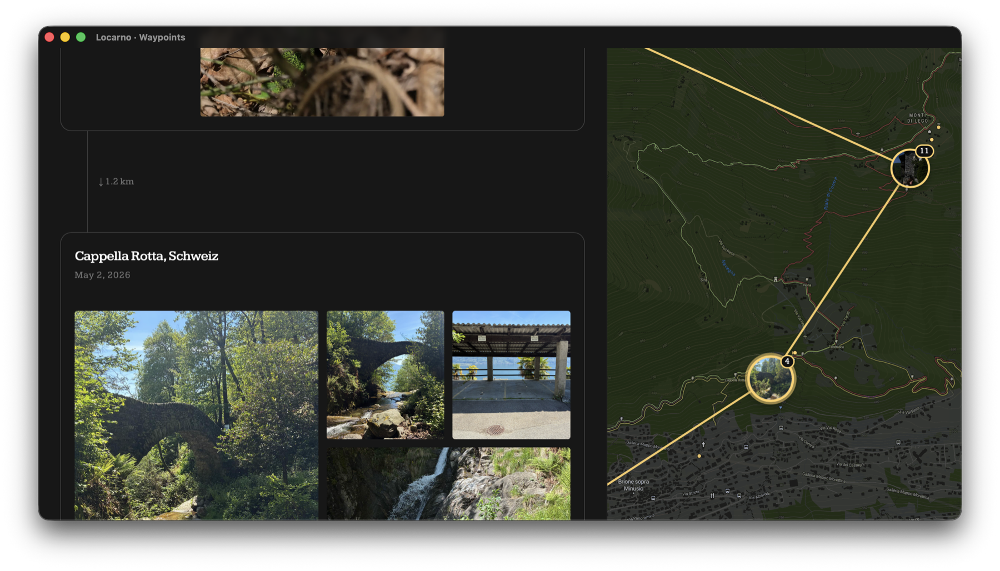

# Waypoints

A private desktop app that reads my [Proton Photos](https://proton.me/drive) albums, decrypts
them locally, and lays each trip out as a timeline of stops on a map.



## Constraints

- **No backend.** Albums are read and decrypted client-side; per-album manifests are cached back
  into Proton Drive under `/.waypoints/`. There is no server or database.
- **Personal & single-user.** Built for one account and a handful of albums.
- **Desktop (Tauri), not a website — for now.** Proton's API only accepts browser calls from
  allowlisted origins. The Tauri webview runs at `tauri://localhost`, which Proton allows; an
  arbitrary web domain isn't allowed, so there's no hosted web version yet.
- **Talks only to Proton and MapTiler** — both European, privacy-respecting. No analytics, CDNs,
  or web fonts.
- **Vendored, pre-production SDK.** Uses the unstable `@protontech/drive-sdk` (vendored under
  `proton-sdk/`); breakage on Proton's side is expected and fixed by hand.

## External dependencies

- **Proton Drive** (`drive-api.proton.me`) — the albums, in-browser end-to-end decryption, and the
  manifest cache. Sign-in opens Proton in the system browser (session fork).
- **MapTiler** (`api.maptiler.com`) — map tiles (`outdoor` style: relief + labels, light/dark) and
  reverse geocoding. European, GDPR-focused. Needs an API key (`VITE_MAPTILER_KEY`) whose allowed
  origins include `tauri://localhost` (and `http://localhost:5174` for dev).

Stack: Vue 3 + Vite + Tailwind v4, Leaflet, vue-i18n (en/de/fr), Tauri v2.

## Run

Requires [bun](https://bun.sh) and the [Rust toolchain](https://rustup.rs) (macOS/Linux — Windows'
webview origin isn't allowlisted by Proton).

```sh
cd web
cp .env.example .env   # set VITE_MAPTILER_KEY
bun install
bun run app            # desktop app, hot-reload  (bun run dev for the raw web build)
```
